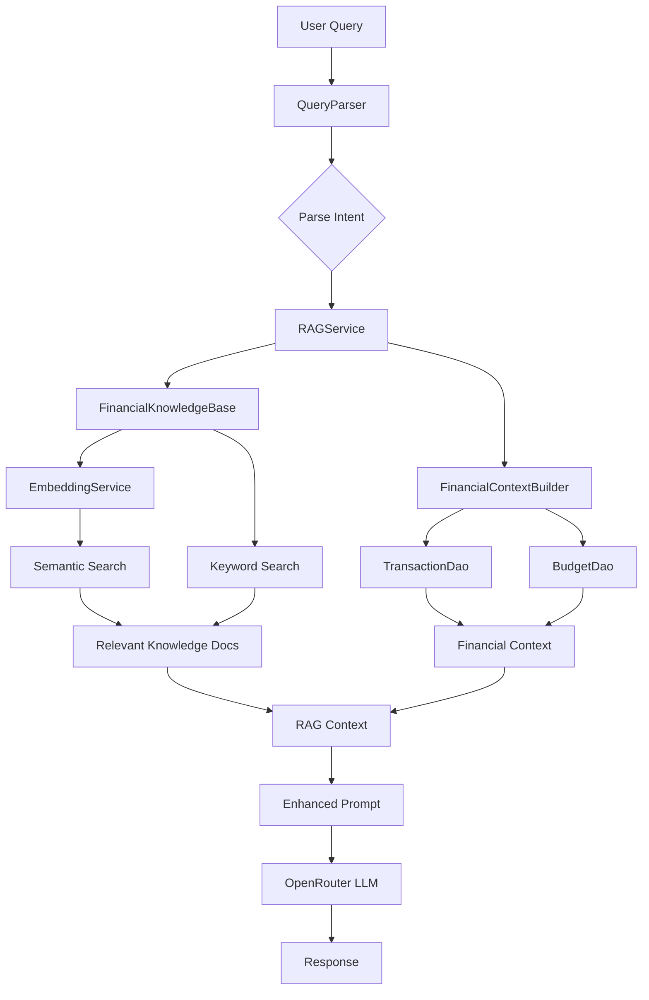

# RAG Implementation for MyMoney Chatbot

This plan outlines the implementation of Retrieval-Augmented Generation (RAG) capabilities for the MyMoney Android app chatbot, enabling it to answer any personal finance question with high accuracy using a comprehensive knowledge base and semantic search.

## Overview

The RAG system will enhance the chatbot by:
1. **Knowledge Base**: A comprehensive bilingual (Vietnamese/English) financial knowledge base with 500+ tips
2. **Semantic Search**: Vector embeddings for intelligent retrieval of relevant knowledge
3. **Enhanced Context**: Richer financial context from user's transaction history
4. **Unified Pipeline**: Integrated retrieval + generation for accurate responses

## User Review Required

> [!IMPORTANT]
> **Vector Embedding Approach**: For Android, I propose using **LLM-based embeddings via OpenRouter API** (same API you already use). This avoids large on-device models (~100MB+) and complex ONNX integration. The trade-off is a slight latency increase for embedding generation.

> [!NOTE]
> **Alternative**: If you prefer fully offline embeddings, we can integrate ONNX Runtime with a small model like `all-MiniLM-L6-v2` (~23MB). This requires additional setup but provides offline capability.

---

## Proposed Changes

### Component 1: Financial Knowledge Base

A comprehensive JSON knowledge base with 500+ bilingual entries covering all personal finance topics.

#### [NEW] [financial_knowledge_base.json](file:///c:/Users/hoisx/OneDrive/Desktop/mymoney/app/src/main/assets/knowledge/financial_knowledge_base.json)

Comprehensive JSON knowledge base with the following structure:

```json
{
  "version": "1.0.0",
  "lastUpdated": "2026-01-07",
  "categories": {
    "budgeting": { ... },
    "saving": { ... },
    "investing": { ... },
    "debt_management": { ... },
    "income": { ... },
    "taxes": { ... },
    "emergency_planning": { ... },
    "category_specific": {
      "food": { ... },
      "transport": { ... },
      "entertainment": { ... },
      ...
    }
  }
}
```

**Topics Covered:**
- **Budgeting Methods**: 50/30/20 rule, envelope method, zero-based budgeting, pay-yourself-first
- **Saving Strategies**: Emergency fund, high-yield accounts, automation, sinking funds
- **Investing Basics**: Compound interest, diversification, risk tolerance, index funds
- **Debt Management**: Snowball vs avalanche, consolidation, refinancing, avoiding debt traps
- **Income Optimization**: Salary negotiation, side hustles, passive income
- **Tax Efficiency**: Deductions, tax-advantaged accounts, timing strategies
- **Category-specific Tips**: Food, transport, entertainment, housing, healthcare, education
- **Vietnamese Context**: Tips specific to Vietnam financial products and practices

---

### Component 2: Knowledge Document Model

#### [NEW] [KnowledgeDocument.java](file:///c:/Users/hoisx/OneDrive/Desktop/mymoney/app/src/main/java/com/example/mymoney/rag/KnowledgeDocument.java)

```java
public class KnowledgeDocument {
    private String id;
    private String topic;
    private String category;
    private String contentEn;      // English content
    private String contentVi;      // Vietnamese content
    private List<String> keywords; // For keyword matching
    private float[] embedding;     // Vector embedding (optional, for semantic search)
    private double relevanceScore; // Calculated during retrieval
}
```

---

### Component 3: Embedding Service

#### [NEW] [EmbeddingService.java](file:///c:/Users/hoisx/OneDrive/Desktop/mymoney/app/src/main/java/com/example/mymoney/rag/EmbeddingService.java)

Uses OpenRouter API with a lightweight embedding model to generate text embeddings:

```java
public class EmbeddingService {
    // Uses OpenRouter embedding endpoint
    public float[] generateEmbedding(String text);
    public float cosineSimilarity(float[] vec1, float[] vec2);
    public void precomputeKnowledgeEmbeddings(List<KnowledgeDocument> docs);
}
```

**Implementation Notes:**
- Uses `openai/text-embedding-3-small` model via OpenRouter (cost-effective)
- Caches embeddings in SharedPreferences or SQLite for performance
- Falls back to keyword matching if embedding fails

---

### Component 4: Knowledge Base Provider

#### [NEW] [FinancialKnowledgeBase.java](file:///c:/Users/hoisx/OneDrive/Desktop/mymoney/app/src/main/java/com/example/mymoney/rag/FinancialKnowledgeBase.java)

Manages the knowledge base and provides retrieval methods:

```java
public class FinancialKnowledgeBase {
    private List<KnowledgeDocument> documents;
    private EmbeddingService embeddingService;
    
    // Load knowledge from assets
    public void loadKnowledge(Context context);
    
    // Retrieve relevant documents using hybrid search
    public List<KnowledgeDocument> retrieveRelevant(String query, int topK);
    
    // Keyword-based retrieval (fallback)
    public List<KnowledgeDocument> keywordSearch(String query, int topK);
    
    // Semantic retrieval using embeddings
    public List<KnowledgeDocument> semanticSearch(String query, int topK);
}
```

---

### Component 5: Enhanced Context Builder

#### [NEW] [FinancialContextBuilder.java](file:///c:/Users/hoisx/OneDrive/Desktop/mymoney/app/src/main/java/com/example/mymoney/rag/FinancialContextBuilder.java)

Builds comprehensive financial context from user's data:

```java
public class FinancialContextBuilder {
    // Get extended financial summary
    public String buildContext(int walletId, QueryIntent intent);
    
    // Historical comparisons (this month vs last month, this year vs last year)
    public String buildComparisonContext(int walletId);
    
    // Trend analysis (spending trends over time)
    public String buildTrendContext(int walletId);
    
    // Category insights
    public String buildCategoryInsights(int walletId, String categoryName);
}
```

---

### Component 6: RAG Orchestration Service

#### [NEW] [RAGService.java](file:///c:/Users/hoisx/OneDrive/Desktop/mymoney/app/src/main/java/com/example/mymoney/rag/RAGService.java)

Orchestrates the full RAG pipeline:

```java
public class RAGService {
    private FinancialKnowledgeBase knowledgeBase;
    private FinancialContextBuilder contextBuilder;
    
    // Full RAG pipeline
    public RAGContext prepareContext(String userQuery, int walletId, QueryIntent intent);
    
    // Build enhanced prompt with retrieved knowledge
    public String buildEnhancedPrompt(RAGContext context, String userQuery);
}
```

---

### Component 7: ChatbotService Integration

#### [MODIFY] [ChatbotService.java](file:///c:/Users/hoisx/OneDrive/Desktop/mymoney/app/src/main/java/com/example/mymoney/chatbot/ChatbotService.java)

Update to use the RAG pipeline:

```diff
 public class ChatbotService {
+    private RAGService ragService;  // Add RAG service
+    private FinancialKnowledgeBase knowledgeBase;
     
     public ChatbotService(Context context) {
         // ... existing initialization ...
+        this.knowledgeBase = new FinancialKnowledgeBase(context);
+        this.ragService = new RAGService(context, knowledgeBase);
     }
     
     public void generateFinancialAdvice(...) {
         // ... existing query parsing ...
         
+        // Step 2.5: Retrieve relevant knowledge
+        RAGContext ragContext = ragService.prepareContext(userMessage, walletId, intent);
         
         // Step 3: Build enhanced prompt with knowledge
-        String userPrompt = "Dữ liệu tài chính:\n" + financialAnalysis + "\n\nCâu hỏi: " + userMessage;
+        String userPrompt = ragService.buildEnhancedPrompt(ragContext, userMessage);
     }
 }
```

---

### Component 8: Enhanced DAO Queries

#### [MODIFY] [TransactionDao.java](file:///c:/Users/hoisx/OneDrive/Desktop/mymoney/app/src/main/java/com/example/mymoney/database/dao/TransactionDao.java)

Add queries for richer context retrieval:

```java
// Average monthly spending by category
@Query("SELECT c.name AS category, AVG(monthly_total) AS average FROM ...")
List<CategoryAverage> getAverageMonthlySpending(int walletId);

// Month-over-month comparison
@Query("SELECT ... current vs previous month ...")
SpendingComparison getMonthlyComparison(int walletId);

// Spending velocity (daily average)
@Query("SELECT SUM(amount) / COUNT(DISTINCT date(created_at/1000, 'unixepoch')) ...")
double getDailySpendingVelocity(int walletId, long startDate, long endDate);
```

---

### Component 9: Database Updates

#### [MODIFY] [AppDatabase.java](file:///c:/Users/hoisx/OneDrive/Desktop/mymoney/app/src/main/java/com/example/mymoney/database/AppDatabase.java)

Increment database version if needed for new queries/entities.

---

## Architecture Diagram



---

## Verification Plan

### Automated Tests
1. **Unit Tests** for knowledge retrieval accuracy
2. **Integration Tests** for full RAG pipeline
3. Run build: `./gradlew build`

### Manual Verification
Test with diverse financial questions:

| Question Type | Example | Expected Behavior |
|--------------|---------|-------------------|
| General Finance | "How to save money?" | Returns budgeting tips from knowledge base |
| Category-specific | "Tips to reduce food spending" | Returns food category tips + user's food spending |
| Vietnamese | "Làm sao để tiết kiệm tiền?" | Returns Vietnamese tips |
| Personal Data | "Am I spending too much?" | Compares user's spending to guidelines |
| Investment | "Should I invest in stocks?" | Returns investment basics from knowledge base |

---

## File Summary

| Type | File | Purpose |
|------|------|---------|
| NEW | `assets/knowledge/financial_knowledge_base.json` | 500+ bilingual financial tips |
| NEW | `rag/KnowledgeDocument.java` | Knowledge document model |
| NEW | `rag/EmbeddingService.java` | Text embedding generation |
| NEW | `rag/FinancialKnowledgeBase.java` | Knowledge retrieval |
| NEW | `rag/FinancialContextBuilder.java` | Enhanced context from DB |
| NEW | `rag/RAGService.java` | RAG orchestration |
| MODIFY | `chatbot/ChatbotService.java` | Integrate RAG pipeline |
| MODIFY | `database/dao/TransactionDao.java` | Enhanced analytics queries |
